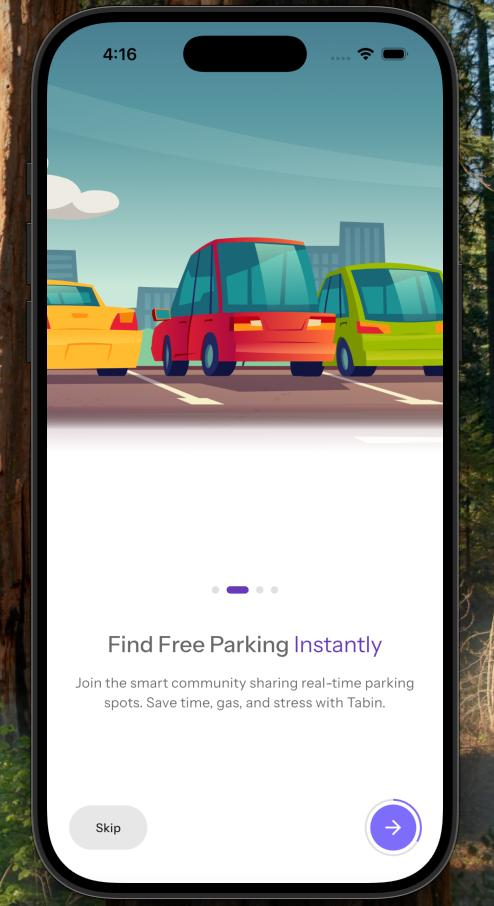
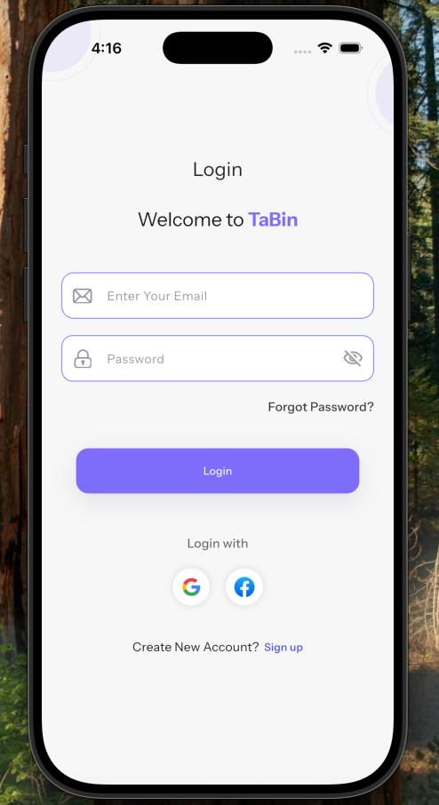
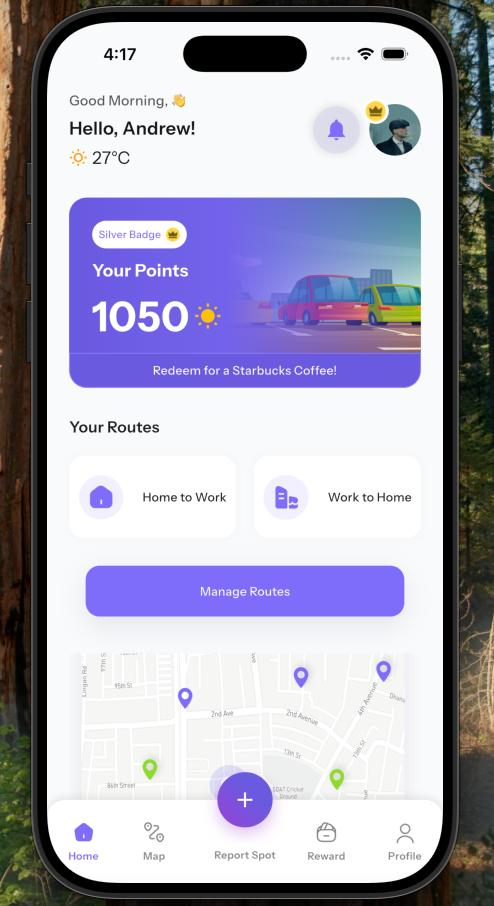
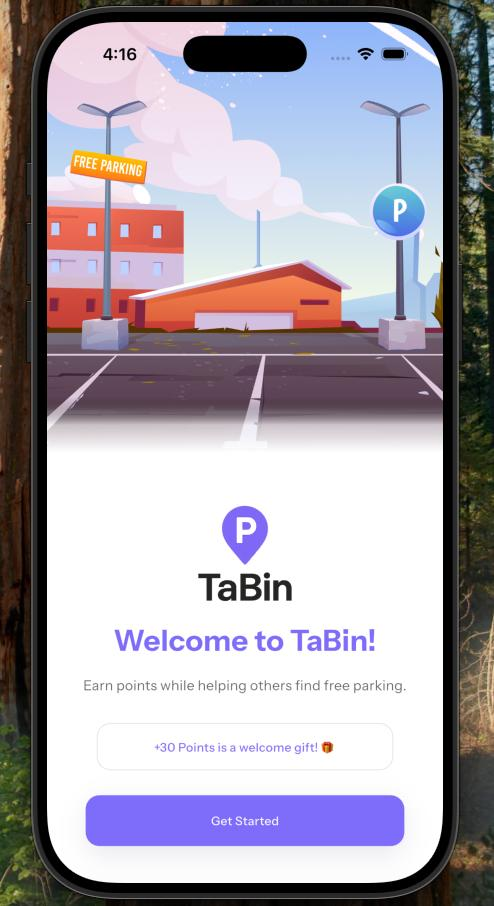
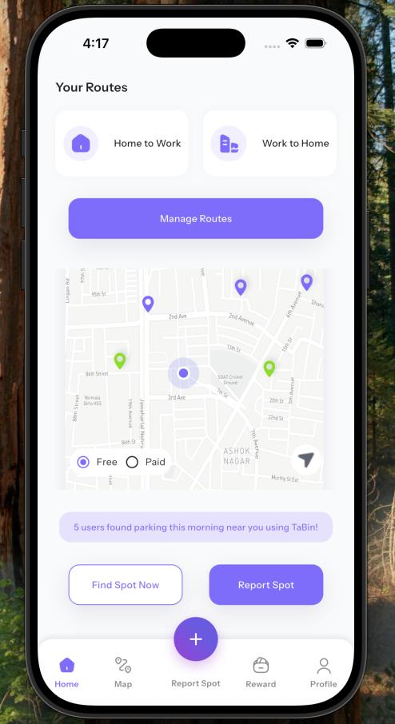

# TaBin - Smart Parking Community App

A comprehensive Flutter application for smart parking solutions that helps users find and report parking spots while earning rewards.

## 📋 Project Overview

**Problem**: Needed fast prototype for client validation.

**Solution**: Designed modular Flutter UI components for parking flows.

**My Contribution**:
- Built reusable UI modules for parking reservations and flows
- Focused on fast iterations for client testing
- Developed 25+ fully functional screens with complete UI and logic

**Impact**: Faster development, successful early client validation.

## 🚗 Key Features

- **Interactive Map Integration** - Real-time parking spot visualization
- **Smart Parking Reports** - Users can report available/occupied spots
- **Rewards System** - Earn points for community contributions
- **Smart Alerts** - Location-based parking notifications
- **User Authentication** - Secure login with social media options
- **Community Dashboard** - Statistics and user engagement features

## 📱 App Screenshots

<!-- App screenshots (added to assets/app_screenshots/) -->

*Onboarding screens and first-run experience*


*Authentication and login UI*


*Main dashboard and parking features*


*Welcome / splash screen*


*Additional app screens and interactions*

## 🛠 Tech Stack

- **Framework**: Flutter 3.35.1
- **Language**: Dart 3.9.0
- **State Management**: GetX
- **UI Components**: Material Design + Custom Components
- **Architecture**: Feature-based modular architecture

## 📋 Prerequisites

Before running this application, make sure you have:

- Flutter SDK (version 3.4.3 or higher)
- Dart SDK (version 3.9.0 or higher)
- Android Studio / VS Code with Flutter extensions
- An Android/iOS device or emulator for testing

## 🚀 Getting Started

### 1. Check Flutter Installation

```bash
flutter --version
```

Expected output:
```
Flutter 3.35.1 • channel stable • https://github.com/flutter/flutter.git
Framework • revision 20f8274939 (7 weeks ago) • 2024-08-14 10:53:09 -0700
Engine • hash 6cd51c08a88e7bbe848a762c20ad3ecb8b063c0e
Tools • Dart 3.9.0 • DevTools 2.48.0
```

### 2. Install Dependencies

```bash
flutter pub get
```

### 3. Run the Application

```bash
# Run on connected device/emulator
flutter run

# Run on specific device
flutter devices
flutter run -d <device_id>

# Run in release mode
flutter run --release
```

### 4. Build for Production

```bash
# Build APK for Android
flutter build apk --release

# Build App Bundle for Google Play Store
flutter build appbundle --release

# Build for iOS (requires macOS and Xcode)
flutter build ios --release
```

## 📂 Project Structure

```
lib/
├── core/                   # Shared utilities and services
│   ├── common/            # Shared widgets and styles
│   ├── utils/             # Constants, helpers, validators
│   └── services/          # Network, storage services
├── features/              # Feature-based modules
│   ├── authentication/   # Login, register, auth
│   ├── onboarding/       # Welcome and intro screens
│   ├── home/             # Dashboard and main features
│   ├── map/              # Map, parking spots, details
│   ├── alerts/           # Smart alerts system
│   ├── rewards/          # Points and redemption
│   ├── profile/          # User profile and settings
│   └── support_ticket/   # Support system
└── routes/               # Navigation configuration
```

## 🔧 Configuration

### Environment Setup
1. Copy `lib/core/utils/constants.dart.example` to `lib/core/utils/constants.dart`
2. Update API endpoints and configuration values
3. Set up Firebase configuration (if using push notifications)

### Dependencies
Key dependencies used in this project:
- `flutter_screenutil` - Responsive UI
- `google_fonts` - Typography
- `shared_preferences` - Local storage
- `http` - API communication
- `persistent_bottom_nav_bar_v2` - Navigation
- `iconsax` - Modern icons


**Built with ❤️ using Flutter**
